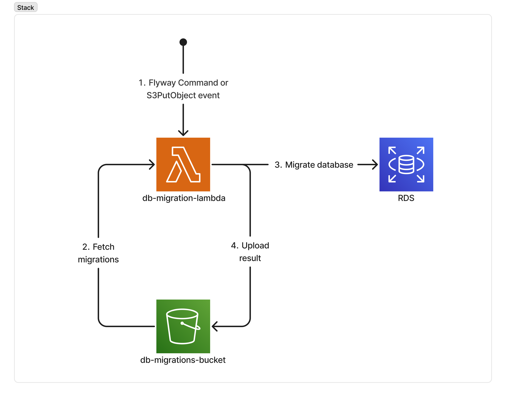

# AWS Flyway

* [Invoke the Lambda](#invoke-the-lambda)
  * [Invoking using AWS CLI](#invoke-using-aws-cli)
  * [Invoke based on `S3PutObject` event](#invoke-based-on-s3putobject-event)

This lambda is responsible for initializing the database schema and data using Flyway.
The database tables are located in the `db-migration-lambda/db/migration` directory.

## Architecture



## Invoke the Lambda

You can invoke the Lambda function with different Flyway commands by sending a payload that specifies the desired command.

Example Payloads:

* Flyway Info
```json
{
  "flyway": "info"
}
```

* Flyway Migrate
```json
{
  "flyway": "migrate"
}
```

### Invoke using AWS CLI:
```shell
aws lambda invoke --function-name db-migration-lambda --payload '{"flyway": "migrate"}' response.json
```

### Invoke based on `S3PutObject` event:

Whenever a new migration file is uploaded to the S3 bucket, the Lambda function will be triggered automatically.

> Inspired by https://github.com/dhet/flyway-awslambda
